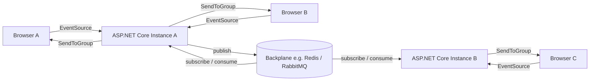
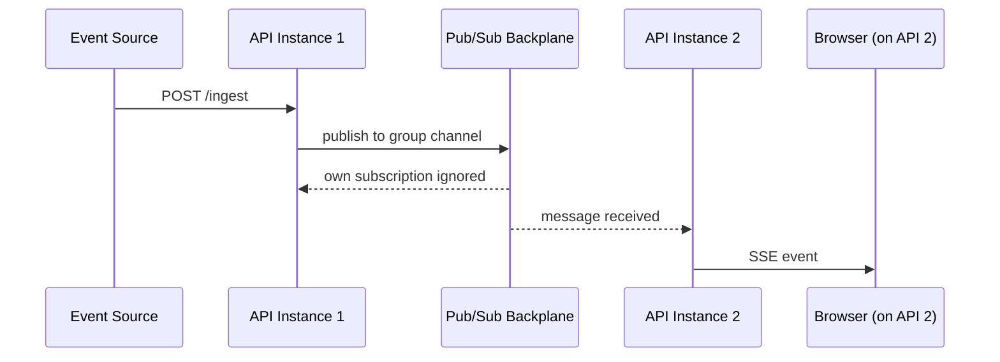
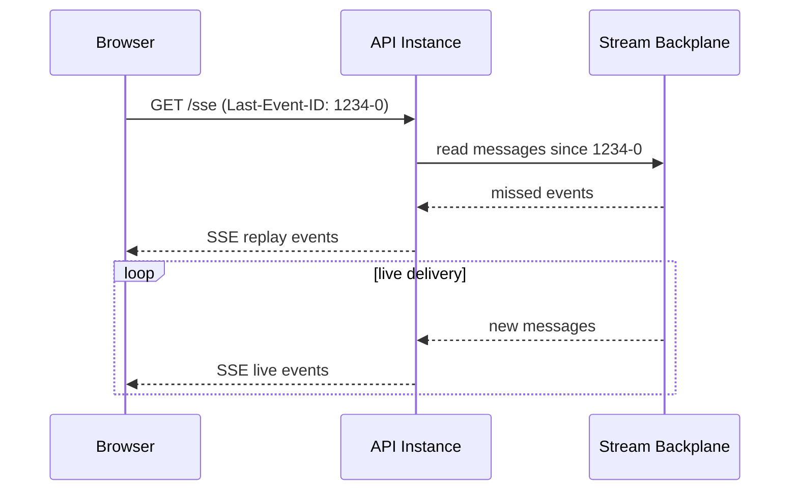
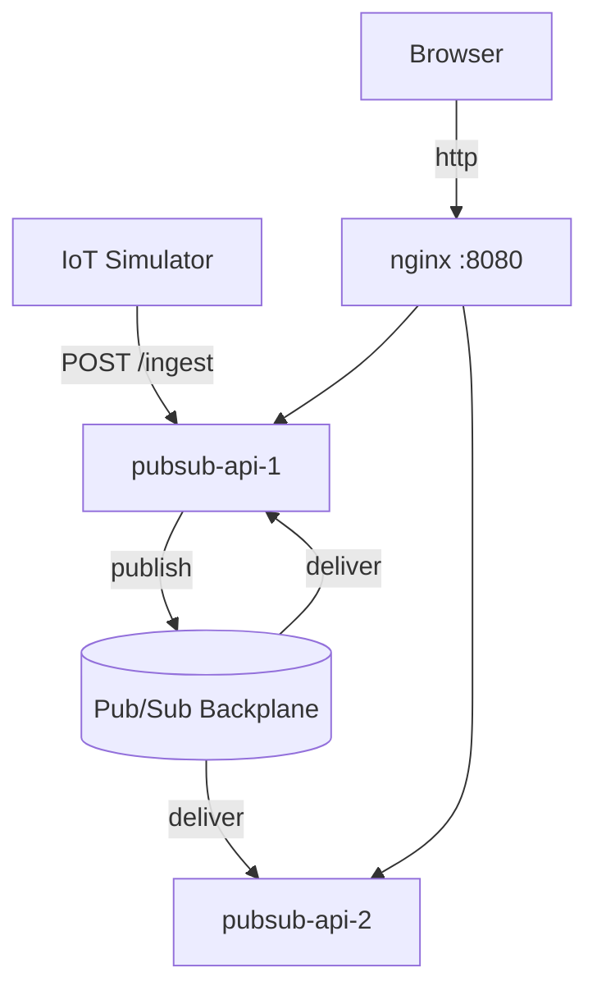
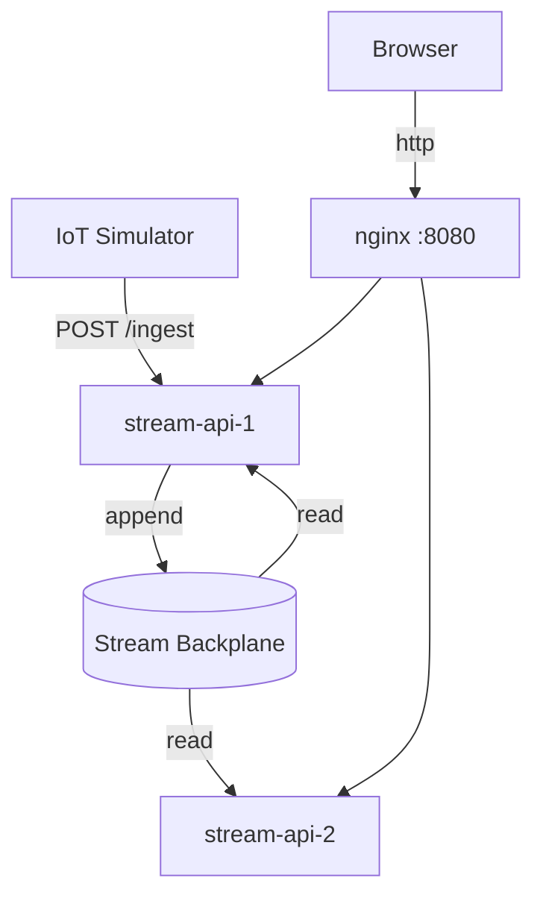

# ProbahoSSE  ·  <sub>প্রবাহ — flow</sub>

> **Multi-instance Server-Sent Events for ASP.NET Core, with a pluggable backplane.**
> Because SSE on one service instance is easy — it's the second, third and more instances that makes things complex. 😄

[](https://www.nuget.org/packages/ProbahoSSE)
[](https://www.nuget.org/packages/ProbahoSSE.RedisPubSub)
[](https://www.nuget.org/packages/ProbahoSSE.RedisStream)
[](https://github.com/ehtesam4m/ProbahoSSE/actions)
[](LICENSE)

ProbahoSSE is a lightweight .NET 10 library that adds multi-instance Server-Sent Events to ASP.NET Core via a **pluggable backplane**. Ship with Redis today, swap to RabbitMQ tomorrow — the core library does not care. It sits on top of the native `TypedResults.ServerSentEvents` API, so the SSE framing is handled by the runtime, not by a pile of `response.WriteAsync(...)` calls.

---

## Table of Contents

- [Why ProbahoSSE?](#why-probahosse)
- [Features](#features)
- [Getting Started](#getting-started)
  - [1. Install NuGet packages](#1-install-nuget-packages)
  - [2. Register services](#2-register-services)
  - [3. Map the SSE endpoint](#3-map-the-sse-endpoint)
  - [4. Publish events](#4-publish-events)
  - [5. Connect from the browser](#5-connect-from-the-browser)
- [Architecture](#architecture)
  - [Core — ProbahoSSE](#core--probahosse)
  - [Pub/Sub Backplane — ProbahoSSE.RedisPubSub](#pubsub-backplane--probahosse-redispubsub)
  - [Persistent Stream Backplane — ProbahoSSE.RedisStream](#persistent-stream-backplane--probahosse-redisstream)
  - [Bring Your Own Backplane](#bring-your-own-backplane)
- [Configuration Reference](#configuration-reference)
- [Samples](#samples)
  - [Sample.RedisPubSub — Fire & Forget](#sampleredispubsub--fire--forget)
  - [Sample.RedisStream — Persistent + Replay](#sampleredisstream--persistent--replay)
  - [Common.IoTSensorSimulator](#commoniotsensorsimulator)
- [Contributing](#contributing)
- [License](#license)

---

## Why ProbahoSSE?

<a id="why-probahosse"></a>

### The problem

SSE on a single server is genuinely simple: open a response stream, keep writing `data:` lines, done. The moment you scale out to two instances, it falls apart. Instance A holds a connection for user Alice. Your event arrives on Instance B. Alice sees nothing. You add sticky sessions. The load balancer team is unhappy. Everyone is unhappy.

### The solution

A shared backplane. Every instance publishes events to the backplane; every instance subscribes and delivers to its own local connections. The browser has no idea any of this is happening — and neither does your application code, which only ever talks to `IProbahoSsePublisher`.

### How does it compare?

| | ProbahoSSE | Raw SSE (single instance) | SignalR |
|---|---|---|---|
| Multi-instance support | ✅ via pluggable backplane | ❌ | ✅ via backplane |
| Protocol | SSE (text, HTTP/1.1+) | SSE | WebSocket / SSE / Long-polling |
| Replay on reconnect | ✅ (Stream backplane) | ❌ | ❌ built-in |
| Complexity | Low | Trivial | Medium–High |
| Client requirement | `EventSource` (built into every browser) | `EventSource` | SignalR JS client |

---

## Features

<a id="features"></a>

- **Group-targeted delivery** — publish to a named group; only connections in that group receive the event
- **Explicit broadcast** — `PublishToAllAsync` + `ProbahoSseGroups.Broadcast` sentinel; fan-out is always an intentional act, never a silent default
- **Keep-alive that actually works** — uses `Task.WhenAny(waitToReadTask, keepAliveTask)` so comment frames are sent even during long quiet periods with zero events
- **Connection limits** — configurable global cap (`MaxGlobalConnections`) and per-group cap (`MaxConnectionsPerUser`); returns `429` when exceeded
- **`Last-Event-ID` replay** — Stream backplane replays every missed event since the client's last-seen ID on reconnect
- **Pluggable backplane** — implement `IProbahoSseBackplane` to connect any message broker: Redis, RabbitMQ, Azure Service Bus, an in-memory bus for tests — whatever fits your stack
- **Native `TypedResults.ServerSentEvents`** — correct SSE framing (id/event/data + blank-line separator) handled by the runtime
- **`connected` event on stream open** — clients receive an immediate `event: connected` frame so the browser never sits in an ambiguous pending state

---

## Getting Started

<a id="getting-started"></a>

### 1. Install NuGet packages

<a id="1-install-nuget-packages"></a>

Always install the core package. Then pick **one** backplane package — or implement your own.

```bash
# Core (always required)
dotnet add package ProbahoSSE

# Pick a backplane:

# Option A — fire-and-forget pub/sub (ships with Redis implementation)
dotnet add package ProbahoSSE.RedisPubSub

# Option B — persistent stream with replay (ships with Redis Streams implementation)
dotnet add package ProbahoSSE.RedisStream
```

> **Using a different broker?** Implement `IProbahoSseBackplane` (and optionally `IProbahoSseReplayable`) and register it with `AddProbahoSse()`. See [Bring Your Own Backplane](#bring-your-own-backplane).

### 2. Register services

<a id="2-register-services"></a>

**Option A — Pub/Sub backplane (fire-and-forget)**

```csharp
// Program.cs
builder.Services
    .AddProbahoSse(options =>
    {
        options.KeepAliveInterval     = TimeSpan.FromSeconds(20);
        options.MaxGlobalConnections  = 10_000;
        options.MaxConnectionsPerUser = 10;
    })
    .AddRedisPubSubBackplane(redis =>
    {
        redis.ConnectionString = builder.Configuration["Redis:ConnectionString"] ?? "localhost:6379";
        redis.ChannelPrefix    = "my-app";
    });
```

**Option B — Stream backplane (persistent + replay)**

```csharp
// Program.cs
builder.Services
    .AddProbahoSse(options =>
    {
        options.KeepAliveInterval = TimeSpan.FromSeconds(20);
    })
    .AddRedisStreamBackplane(redis =>
    {
        redis.ConnectionString = builder.Configuration["Redis:ConnectionString"] ?? "localhost:6379";
        redis.ChannelPrefix    = "my-app";
        redis.StreamMaxLength  = 10_000;
    });
```

### 3. Map the SSE endpoint

<a id="3-map-the-sse-endpoint"></a>

```csharp
app.UseProbahoSse();

// The second argument resolves the group from the request.
// Return null or empty string to skip group assignment.
app.MapProbahoSse("/sse", ctx => ctx.Request.Query["group"].FirstOrDefault());

// OR — use your own minimal API endpoint mapper (e.g. group from route. UserId can be your group)
app.MapGet("/users/{userId}/sse", (string userId, HttpContext ctx) =>
    SseEndpointHandler.HandleAsync(ctx, userId));

// OR — use from an MVC controller action
// SseEndpointHandler.HandleAsync takes the current HttpContext so it works anywhere:

[ApiController]
[Route("api/[controller]")]
public class EventsController : ControllerBase
{
    // Group from route segment
    [HttpGet("{group}/stream")]
    public Task Stream(string group) =>
         SseEndpointHandler.HandleAsync(HttpContext, group);

    // Group from authenticated user identity
     [HttpGet("stream")]
     [Authorize]
     public Task Stream() =>
         SseEndpointHandler.HandleAsync(HttpContext,
             User.FindFirstValue(ClaimTypes.NameIdentifier));
 }
```


### 4. Publish events

<a id="4-publish-events"></a>

Inject `IProbahoSsePublisher` anywhere — a background service, a webhook endpoint, a RabbitMQ consumer, whatever produces events.

```csharp
// Targeted — only connections in group "alice" receive this
await publisher.PublishToGroupAsync(
    "alice",
    ProbahoSseEvent.Create(
        data:      JsonSerializer.Serialize(payload),
        eventType: "reading",
        id:        null,
        group:     "alice"));

// Broadcast — every connected client across every instance receives this
await publisher.PublishToAllAsync(
    ProbahoSseEvent.Create(
        data:      "{\"type\":\"maintenance\"}",
        eventType: "announcement",
        id:        null,
        group:     ProbahoSseGroups.Broadcast));
```

> **Note:** `PublishToAllAsync` is intentionally separate from `PublishToGroupAsync`. If you want to broadcast, you must say so explicitly — there is no silent fan-out that accidentally sends Alice's data to Bob.

### 5. Connect from the browser

<a id="5-connect-from-the-browser"></a>

```javascript
const evtSource = new EventSource('/sse?group=alice');

evtSource.addEventListener('connected', () => console.log('SSE stream established'));

evtSource.addEventListener('reading', e => {
  const data = JSON.parse(e.data);
  console.log(`${data.sensor}: ${data.value} ${data.unit}`);
});

evtSource.addEventListener('alert', e => {
  console.warn(`ALERT — ${JSON.parse(e.data).sensor}`);
});

evtSource.onerror = () => {
  // EventSource reconnects automatically with Last-Event-ID.
  // A Stream backplane replays missed events since that ID.
};
```

---

## Architecture

<a id="architecture"></a>

### Overall fan-out flow



Each API instance only talks to its own in-memory connection registry. The backplane is the single shared fact: whoever published the event doesn't matter; whoever is subscribed delivers it.

---

### Core — ProbahoSSE

<a id="core--probahosse"></a>

**`SseConnectionManager`** — flat `ConcurrentDictionary<connectionId, IProbahoSseConnection>` with a per-group counter dictionary. Avoids nested-dictionary concurrency footguns at the cost of a linear scan on `SendToGroupAsync` — acceptable for tens of thousands of connections.

**`SseEndpointHandler`** — drives a single `IAsyncEnumerable<SseItem<string>>` via `TypedResults.ServerSentEvents`. Uses `Task.WhenAny(waitToReadTask, keepAliveTask)` so keep-alive fires even when no events arrive.

**`IProbahoSseBackplane`** — the contract every backplane must implement. Exposes `PublishToGroupAsync` and `PublishToAllAsync`. Implement `IProbahoSseReplayable` to enable `Last-Event-ID` replay.

---

### Pub/Sub Backplane — ProbahoSSE.RedisPubSub

<a id="pubsub-backplane--probahosse-redispubsub"></a>

Ships with a **Redis Pub/Sub** implementation. The pattern applies equally to RabbitMQ fanout exchanges or any other pub/sub primitive.



- **Fire-and-forget** — no message persistence; offline consumers miss events permanently
- `PublishToGroupAsync` stamps the `Group` field and publishes to channel `{prefix}:{group}`
- **Best for:** notification feeds, live dashboards, chat

---

### Persistent Stream Backplane — ProbahoSSE.RedisStream

<a id="persistent-stream-backplane--probahosse-redisstream"></a>

Ships with a **Redis Streams** implementation. The same pattern works with RabbitMQ or any log-structured broker that supports offset-based reads.



- **Persistent** — messages retained up to `StreamMaxLength`; older entries trimmed automatically
- Each instance independently polls the stream via `XREAD` — no consumer groups, no stale state on autoscaling
- `IProbahoSseReplayable` triggers `ReplayFromAsync(lastEventId)` before the live loop; reconnecting browsers replay missed events via `XRANGE`
- **Best for:** IoT feeds, financial ticks, audit trails

---

### Bring Your Own Backplane

<a id="bring-your-own-backplane"></a>

```csharp
public class RabbitMqBackplane : IProbahoSseBackplane
{
    public Task PublishToGroupAsync(string group, IProbahoSseEvent sseEvent,
        CancellationToken ct = default)
    {
        // publish to RabbitMQ fanout exchange, routing key = group
    }

    public Task PublishToAllAsync(IProbahoSseEvent sseEvent,
        CancellationToken ct = default)
    {
        // routing key = ProbahoSseGroups.Broadcast
    }
}
```

Register it:

```csharp
builder.Services
    .AddProbahoSse()
    .AddSingleton<IProbahoSseBackplane, RabbitMqBackplane>()
    .AddHostedService<RabbitMqListenerService>();
```

Implement `IProbahoSseReplayable` on the same class to add replay support (e.g. backed by a RabbitMQ offset read or database query).

---

## Configuration Reference

<a id="configuration-reference"></a>

### `ProbahoSseOptions`

| Property | Type | Default | Description |
|---|---|---|---|
| `MaxGlobalConnections` | `int` | `10 000` | Global connection cap. Returns `429` when exceeded. `0` = unlimited. |
| `MaxConnectionsPerUser` | `int` | `10` | Per-group connection cap. Returns `429` when exceeded. |
| `KeepAliveInterval` | `TimeSpan` | `30s` | How often keep-alive comment frames are sent to prevent proxy timeouts. |
| `DefaultEventType` | `string` | `"message"` | Fallback event type when `IProbahoSseEvent.EventType` is null. |

### `RedisPubSubOptions`

| Property | Type | Default | Description |
|---|---|---|---|
| `ConnectionString` | `string` | `"localhost:6379"` | StackExchange.Redis connection string. |
| `ChannelPrefix` | `string` | `"probaho"` | Prefix for Redis channel names. Avoids collisions in a shared Redis instance. |

### `RedisStreamOptions`

| Property | Type | Default | Description |
|---|---|---|---|
| `ConnectionString` | `string` | `"localhost:6379"` | StackExchange.Redis connection string. |
| `ChannelPrefix` | `string` | `"probaho"` | Prefix for Redis stream keys. Avoids collisions in a shared Redis instance. |
| `StreamMaxLength` | `int` | `10 000` | Maximum entries retained. Older entries trimmed automatically. |
| `StreamPollingIntervalMs` | `int` | `100` | Polling interval (ms) when no new messages are available. Lower = less latency, more Redis load. |

---

## Samples

<a id="samples"></a>

Both samples include nginx, two API instances, the IoT Simulator, and a dark-themed browser UI at `http://localhost:8080`. The UI auto-detects the backplane via `/info`, shows live sensor gauges per group, and highlights replayed events in purple.

---

### Sample.RedisPubSub — Fire & Forget

<a id="sampleredispubsub--fire--forget"></a>



**Demonstrates:** events missed while disconnected are gone forever. Reconnect and the event ID counter will have jumped — the gap is the evidence.

**Stack:** `redis` · `simulator` · `pubsub-api-1` · `pubsub-api-2` · `nginx`

```bash
cd samples/Sample.RedisPubSub
docker compose up --build
```

---

### Sample.RedisStream — Persistent + Replay

<a id="sampleredisstream--persistent--replay"></a>



**Demonstrates:** missed events replay on reconnect, highlighted in purple in the feed.

**Stack:** `redis` · `simulator` · `stream-api-1` · `stream-api-2` · `nginx`

```bash
cd samples/Sample.RedisStream
docker compose up --build
```

---

### Common.IoTSensorSimulator

<a id="commoniotsensorsimulator"></a>

Standalone HTTP producer — no knowledge of the backplane, just POSTs JSON to `/ingest`. 4 groups × 4 sensors = 16 concurrent sensor loops. Waits for `/health` before starting.

| Key | Default | Description |
|---|---|---|
| `Simulator__IngestUrl` | `http://localhost:8080/ingest` | Target ingest endpoint |
| `Simulator__RetryDelayMs` | `3000` | Back-off on failure (ms) |

---

## Contributing

<a id="contributing"></a>

1. Fork the repo
2. `git checkout -b feat/my-feature`
3. Commit and open a PR against `main`

Project targets **.NET 10**. Include unit tests (`tests/ProbahoSSE.Tests.Unit`) and, for backplane changes, integration tests (`tests/ProbahoSSE.Tests.Integration`) with Docker available.

---

## License

<a id="license"></a>

MIT — see [LICENSE](LICENSE) for details.
